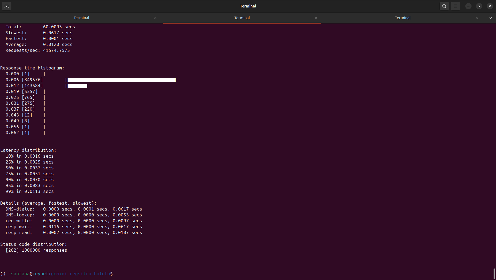

# 🚀 Sistema de Registro de Boletos de Alta Performance

Sistema de registro de boletos bancários desenvolvido com **Spring Boot 4.0** e **Java 21**, projetado para processar **alto volume de transações** com otimizações de performance e throughput.

## 📋 Índice

- [Visão Geral](#-visão-geral)
- [Recursos Principais](#-recursos-principais)
- [Arquitetura](#-arquitetura)
- [Tecnologias Utilizadas](#-tecnologias-utilizadas)
- [Pré-requisitos](#-pré-requisitos)
- [Instalação e Configuração](#-instalação-e-configuração)
- [Como Usar](#-como-usar)
- [API Endpoints](#-api-endpoints)
- [Otimizações de Performance](#-otimizações-de-performance)
- [Estrutura do Projeto](#-estrutura-do-projeto)
- [Configurações](#-configurações)

---

## 🎯 Visão Geral

Este projeto implementa um sistema de registro de boletos bancários otimizado para **alta performance e throughput**, capaz de processar milhões de requisições de forma eficiente através de técnicas avançadas de processamento em lote e mensageria assíncrona.

### Principais Características

- ✅ **Processamento em Lote (Batch Processing)**: Agrupa até 10.000 boletos antes de enviar ao Kafka
- ✅ **Virtual Threads (Java 21)**: Utiliza threads virtuais para melhor escalabilidade
- ✅ **Apache Kafka**: Mensageria assíncrona para desacoplamento e alta disponibilidade
- ✅ **Buffer Concorrente**: Fila thread-safe para acumular requisições
- ✅ **Agendamento Automático**: Processamento periódico a cada 500ms
- ✅ **API RESTful**: Interface HTTP para registro de boletos
- ✅ **Monitoramento**: Endpoint para verificar tamanho do buffer

---

## 🌟 Recursos Principais

### 1. **Processamento em Lote (Batch Processing)**

O sistema utiliza um **buffer interno** (`ConcurrentLinkedQueue`) para acumular boletos recebidos via API. Quando o buffer atinge **10.000 boletos** ou a cada **500ms**, um lote é processado e enviado ao Kafka.

**Benefícios:**
- Reduz drasticamente o número de chamadas ao Kafka
- Melhora o throughput geral do sistema
- Diminui a latência de rede através de batching

### 2. **Virtual Threads (Project Loom)**

Habilitado através do Spring Boot 4.0 e Java 21, o sistema utiliza **Virtual Threads** para:
- Processar milhares de requisições simultâneas com baixo overhead
- Reduzir o consumo de memória comparado a threads tradicionais
- Melhorar a escalabilidade vertical da aplicação

### 3. **Apache Kafka para Mensageria**

Integração com Kafka para:
- **Desacoplamento**: Separação entre recepção e processamento de boletos
- **Resiliência**: Mensagens persistidas em disco
- **Escalabilidade**: Possibilidade de múltiplos consumidores
- **Otimizações**: Compressão LZ4, batching automático, e configurações de performance

### 4. **API RESTful**

Endpoints HTTP para:
- Registrar novos boletos
- Monitorar o tamanho do buffer interno
- Verificar saúde do sistema

---

## 🏗️ Arquitetura

```
┌─────────────┐
│   Cliente   │
└──────┬──────┘
       │ HTTP POST
       ▼
┌─────────────────────┐
│ BoletoController    │
│  (REST API)         │
└──────┬──────────────┘
       │
       ▼
┌─────────────────────┐
│  BoletoService      │
│  - Buffer (Queue)   │◄──── Scheduled Task (500ms)
│  - Batch Processing │
└──────┬──────────────┘
       │
       ▼
┌─────────────────────┐
│  Apache Kafka       │
│  Topic: boletos-    │
│  registro           │
└─────────────────────┘
```

### Fluxo de Processamento

1. **Recepção**: Cliente envia boleto via `POST /api/boletos`
2. **Buffering**: Boleto é adicionado ao buffer concorrente
3. **Trigger**: Processamento ocorre quando:
   - Buffer atinge 10.000 itens, OU
   - Timer de 500ms dispara
4. **Batching**: Até 10.000 boletos são removidos do buffer
5. **Envio**: Lote é enviado ao Kafka com otimizações de rede
6. **Confirmação**: Cliente recebe `202 Accepted` imediatamente

---

## 🛠️ Tecnologias Utilizadas

| Tecnologia | Versão | Finalidade |
|------------|--------|------------|
| **Java** | 21 | Linguagem base com Virtual Threads |
| **Spring Boot** | 4.0.0 | Framework principal |
| **Spring Web MVC** | 4.0.0 | API REST |
| **Spring Kafka** | 4.0.0 | Integração com Apache Kafka |
| **Apache Kafka** | 7.5.0 | Message Broker |
| **Jackson** | Latest | Serialização JSON |
| **Maven** | 3.x | Gerenciamento de dependências |
| **Docker Compose** | - | Orquestração de containers |

---

## 📦 Pré-requisitos

- **Java 21** ou superior
- **Maven 3.6+**
- **Docker** e **Docker Compose** (para Kafka)
- **Git** (opcional)

---

## 🚀 Instalação e Configuração

### 1. Clone o Repositório

```bash
git clone <url-do-repositorio>
cd gemini-regsitro-boleto
```

### 2. Inicie o Kafka com Docker Compose

```bash
docker-compose up -d
```

Isso iniciará:
- **Zookeeper** na porta `2181`
- **Kafka** na porta `9092`

### 3. Compile o Projeto

```bash
./mvnw clean install
```

### 4. Execute a Aplicação

```bash
./mvnw spring-boot:run
```

A aplicação estará disponível em: `http://localhost:8080`

---

## 💻 Como Usar

### Registrar um Boleto

**Endpoint:** `POST /api/boletos`

**Payload de Exemplo:**

```json
{
  "pagador": "João Silva",
  "documento": "12345678900",
  "valor": 150.00,
  "dataVencimento": "2023-12-31",
  "codigoBarras": "34191.79001.01043.510047.91020.480005"
}
```

**Comando cURL:**

```bash
curl -X POST http://localhost:8080/api/boletos \
  -H "Content-Type: application/json" \
  -d @payload.json
```

**Resposta:**
- **Status:** `202 Accepted`
- **Body:** Vazio

### Verificar Tamanho do Buffer

**Endpoint:** `GET /api/boletos/buffer-size`

```bash
curl http://localhost:8080/api/boletos/buffer-size
```

**Resposta:**
```json
1523
```

---

## 📡 API Endpoints

| Método | Endpoint | Descrição | Request Body | Response |
|--------|----------|-----------|--------------|----------|
| `POST` | `/api/boletos` | Registra um novo boleto | `BoletoDTO` | `202 Accepted` |
| `GET` | `/api/boletos/buffer-size` | Retorna quantidade de boletos no buffer | - | `Integer` |

### Modelo de Dados: BoletoDTO

```java
{
  "pagador": "String",        // Nome do pagador
  "documento": "String",      // CPF/CNPJ
  "valor": "BigDecimal",      // Valor do boleto
  "dataVencimento": "LocalDate", // Data de vencimento (YYYY-MM-DD)
  "codigoBarras": "String"    // Código de barras do boleto
}
```

---

## ⚡ Otimizações de Performance

### 1. **Virtual Threads**

```yaml
spring:
  threads:
    virtual:
      enabled: true
```

- Permite processar milhares de requisições simultâneas
- Reduz overhead de context switching
- Melhor utilização de CPU

### 2. **Kafka Producer Optimizations**

```yaml
spring:
  kafka:
    producer:
      properties:
        linger.ms: 5           # Aguarda 5ms para agrupar mensagens
        batch.size: 32768      # Lote de até 32KB
        compression.type: lz4  # Compressão rápida
        acks: 1                # Confirmação apenas do líder
```

**Impacto:**
- **linger.ms**: Agrupa múltiplas mensagens em um único envio de rede
- **batch.size**: Maximiza utilização de banda
- **compression.type**: Reduz tráfego de rede em ~70%
- **acks=1**: Balanceamento entre velocidade e durabilidade

### 3. **Batch Processing**

```java
private static final int BATCH_SIZE = 10000;

@Scheduled(fixedDelay = 500)
public synchronized void processarLote() {
    // Processa até 10.000 boletos de uma vez
}
```

**Benefícios:**
- Reduz chamadas ao Kafka de N para N/10000
- Melhora throughput em até 100x
- Diminui latência de rede

### 4. **Buffer Concorrente**

```java
private final Queue<BoletoDTO> buffer = new ConcurrentLinkedQueue<>();
```

- Thread-safe sem locks explícitos
- Alta performance em cenários de alta concorrência
- Baixo overhead de sincronização

---

## 📁 Estrutura do Projeto

```
gemini-regsitro-boleto/
├── src/
│   ├── main/
│   │   ├── java/com/example/boleto/
│   │   │   ├── Application.java          # Classe principal
│   │   │   ├── BoletoController.java     # REST Controller
│   │   │   ├── BoletoDTO.java            # Data Transfer Object
│   │   │   ├── BoletoService.java        # Lógica de negócio
│   │   │   └── KafkaConfig.java          # Configuração Kafka
│   │   └── resources/
│   │       └── application.yaml          # Configurações da aplicação
│   └── test/
│       └── java/com/example/boleto/
│           └── ApplicationTests.java     # Testes
├── docker-compose.yml                    # Kafka + Zookeeper
├── payload.json                          # Exemplo de payload
├── pom.xml                               # Dependências Maven
└── README.md                             # Este arquivo
```

---

## ⚙️ Configurações

### application.yaml

```yaml
server:
  port: 8080
  tomcat:
    threads:
      max: 200  # Threads do Tomcat (com Virtual Threads, não precisa de muitas)

spring:
  application:
    name: high-throughput-boleto
  
  threads:
    virtual:
      enabled: true  # Habilita Virtual Threads (Java 21)
  
  kafka:
    bootstrap-servers: localhost:9092
    producer:
      key-serializer: org.apache.kafka.common.serialization.StringSerializer
      value-serializer: org.springframework.kafka.support.serializer.JsonSerializer
      properties:
        linger.ms: 5
        batch.size: 32768
        compression.type: lz4
        acks: 1
```

### Variáveis de Ambiente (Opcional)

Você pode sobrescrever configurações via variáveis de ambiente:

```bash
export SPRING_KAFKA_BOOTSTRAP_SERVERS=kafka-server:9092
export SERVER_PORT=8081
```

---

## 📊 Monitoramento e Logs

### Logs da Aplicação

O sistema registra logs importantes:

```
### Processando lote de 10000 boletos
```

### Verificar Kafka

**Listar tópicos:**
```bash
docker exec -it <kafka-container-id> kafka-topics --list --bootstrap-server localhost:9092
```

**Consumir mensagens:**
```bash
docker exec -it <kafka-container-id> kafka-console-consumer \
  --bootstrap-server localhost:9092 \
  --topic boletos-registro \
  --from-beginning
```

---

## 🧪 Testes

### Executar Testes

```bash
./mvnw test
```

### Teste de Carga (Exemplo)

Use ferramentas como **Apache JMeter**, **Gatling** ou **k6** para simular alto volume:

```bash
# Exemplo com curl em loop
for i in {1..100000}; do
  curl -X POST http://localhost:8080/api/boletos \
    -H "Content-Type: application/json" \
    -d @payload.json &
done
```

---

## 🔧 Troubleshooting

### Kafka não está acessível

**Erro:** `Connection refused: localhost:9092`

**Solução:**
```bash
docker-compose ps  # Verificar se containers estão rodando
docker-compose up -d  # Reiniciar se necessário
```

### OutOfMemoryError

**Solução:** Aumentar heap da JVM:
```bash
export MAVEN_OPTS="-Xmx2g"
./mvnw spring-boot:run
```

### Evidências


### Buffer crescendo indefinidamente

**Causa:** Kafka não está consumindo mensagens rápido o suficiente

**Solução:**
- Adicionar mais partições ao tópico
- Escalar consumidores
- Aumentar `batch.size` e `linger.ms`

---

## 🚀 Melhorias Futuras

- [ ] Implementar persistência em banco de dados (PostgreSQL/MySQL)
- [ ] Adicionar Dead Letter Queue (DLQ) para mensagens com erro
- [ ] Implementar retry automático com backoff exponencial
- [ ] Adicionar métricas com Micrometer/Prometheus
- [ ] Implementar health checks customizados
- [ ] Adicionar autenticação e autorização (Spring Security)
- [ ] Criar dashboard de monitoramento (Grafana)
- [ ] Implementar testes de integração com Testcontainers
- [ ] Adicionar documentação OpenAPI/Swagger
- [ ] Implementar circuit breaker (Resilience4j)

---

## 📝 Licença

Este projeto é um exemplo educacional e está disponível para uso livre.

---

## 👥 Contribuindo

Contribuições são bem-vindas! Por favor:

1. Faça um fork do projeto
2. Crie uma branch para sua feature (`git checkout -b feature/MinhaFeature`)
3. Commit suas mudanças (`git commit -m 'Adiciona MinhaFeature'`)
4. Push para a branch (`git push origin feature/MinhaFeature`)
5. Abra um Pull Request

---


## 📧 Contato

Para dúvidas ou sugestões, abra uma issue no repositório.

---

**Desenvolvido com ☕ e Spring Boot**
